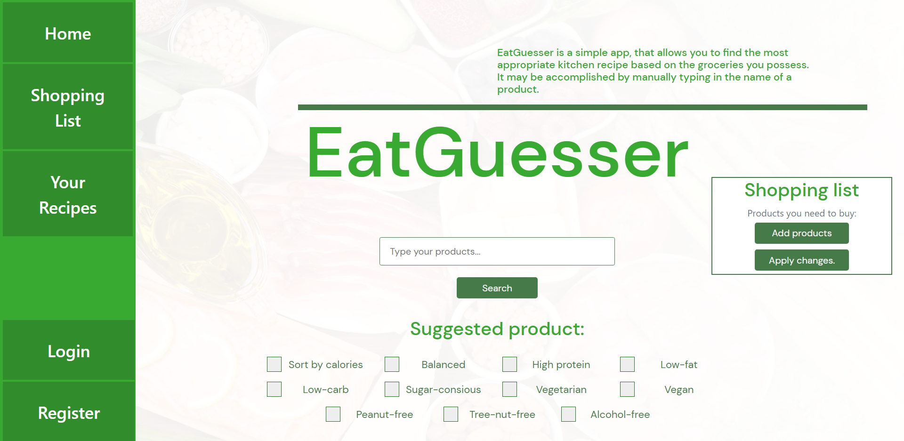
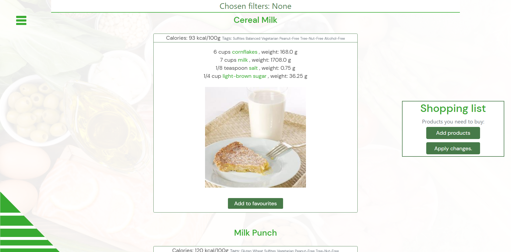

# EatGuesser is a semester group project for Python in the enterprise classes 
## Short description of the idea
EatGuesser is an app that allows you to find the most appropriate kitchen recipe on the basis of the groceries you possess. It may be accomplished by manual typing each name of the product. Enhanced version of project description can be found [here](enhanced.txt).
[Our website.](https://eat-guesser.herokuapp.com/)

Included features:
- showing recipes from products typed into the search engine
- creating shopping list
- showing location of the nearest shop 
- counting calories
- filtering by the amount of calories
- other available filters: balanced, high protein, low-fat, low-carb, vegan, vegetarian, etc.
- possibility to create an account

## The appearance of the page

